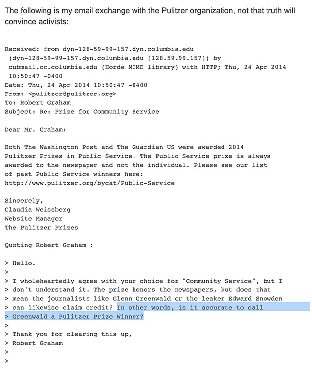
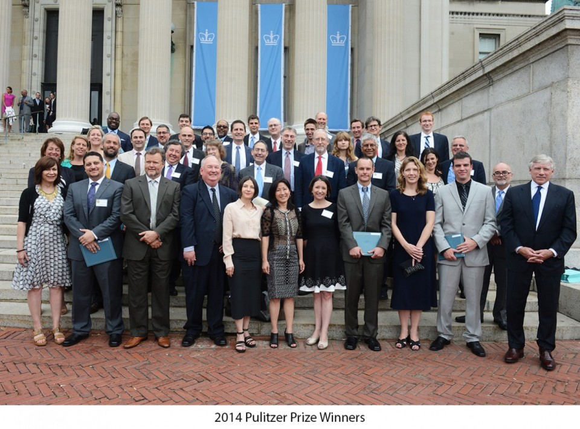
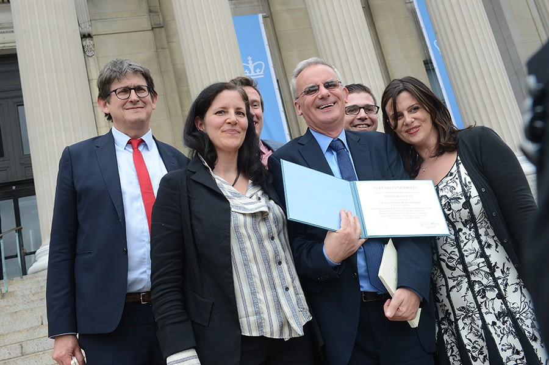

# Well, does he?

Of course not. 

Awkward [the Pulitzer people even had to address the question](https://blog.erratasec.com/2014/04/no-glenn-greenwald-did-not-win-pulitzer.html#.YLhmeS1Q3UJ). 

## That Pulitzer Email

Under active development.
{: .notice--danger}

Detailed explanation to come, but this is the definitive email.

## The Pulitzer website

### Where's Glenndo?

[{: .align-center}](assets/images/2014groupphoto1290.jpg)

This appears on the [Pulitzer website](https://www.pulitzer.org/event/2014-pulitzer-prize-luncheon), with that caption. There are other photographs of the awwards ceremony at the bottom of that page including the Guardian awards winners.
[{: .align-right .jason}](assets/images/guardianwinners.jpg)

Do you really think Glenn would have skipped the awards ceremony if he'd been invited, when he bothered to fly from Brazil to the US for the awards _annoucement_ and the Polk a month earlier?

> ##### "Will you let me hold your Pulitzer?"
> 
> _Yes, that really is something Glenn tweeted._

## What did Glenn pick up?

Glenn flew back to NYC barely in time to collect a Polk award and in anticipation of the Pulizer Prize annoucement.  
During a very busy day, he found time to tweet excitedly about the release from prison of the neo-Nazi, Weev.

> ### _"What's up bro?"_

Depending on whether you believe what was said at the time, or what Glenn said years later, he either:

- spent the weekend partying with known Nazi Weev;
- or was photobombed by unknown future Nazi Weev.

_More details in the linked Twitter threads_.
{: .notice--warning}

<blockquote class="twitter-tweet">
Yes, Nazis are famous for loving people like me: a gay Jew in an inter-racial marriage with brown children. Nazis adore us.  I met him once in my life - 6 years ago at a party that wasn&#39;t mine and before his Nazism was known. That he&#39;s my friend, let alone &quot;bestie&quot;, is a lie.
&mdash; Glenn Greenwald (@ggreenwald) <a href="https://twitter.com/ggreenwald/status/1255879508034535426?ref_src=twsrc%5Etfw">April 30, 2020</a></blockquote> 
<blockquote class="twitter-tweet">
Best weekend in awhile. <a href="https://twitter.com/rabite?ref_src=twsrc%5Etfw">@rabite</a> gets out, we party with <a href="https://twitter.com/ggreenwald?ref_src=twsrc%5Etfw">@ggreenwald</a> Laura Poitras and others, sunday lunch with <a href="https://twitter.com/johncusack?ref_src=twsrc%5Etfw">@johncusack</a> and <a href="https://twitter.com/JPBarlow?ref_src=twsrc%5Etfw">@JPBarlow</a>
&mdash; Gregg Housh (@GreggHoush) <a href="https://twitter.com/GreggHoush/status/455509841415778304?ref_src=twsrc%5Etfw">April 14, 2014</a></blockquote> 

<blockquote class="twitter-tweet">>
The time zone for the Wayback Machine snapshot takes some figuring out,  but his four tweets came right after the Polk awards - when there was huge demand for interviews.  He still found time to tweet about Weev - the guy he says photobombed him later that weekend. <a href="https://t.co/IeIKhsN0ov">pic.twitter.com/IeIKhsN0ov</a>
&mdash; Alan Stacey (@AlanVRK) <a href="https://twitter.com/AlanVRK/status/1494108045177143296?ref_src=twsrc%5Etfw">February 17, 2022</a></blockquote> 

<blockquote class="twitter-tweet">
It was tweeted in real time by Weev  - who was as enthusiastic about meeting Glenn as Glenn had been tweeting about Weev one day earlier, when everyone else wanted to talk about his Polk award.  From the Wayback Machine. <a href="https://t.co/4V3NlpbxzJ">pic.twitter.com/4V3NlpbxzJ</a>
&mdash; Alan Stacey (@AlanVRK) <a href="https://twitter.com/AlanVRK/status/1494664548896358400?ref_src=twsrc%5Etfw">February 18, 2022</a></blockquote> 

{: .cl}

# So what's that rabbit about?

Well he really [does have a Hugh Hefner award](https://www.usnews.com/news/blogs/washington-whispers/2014/05/21/glenn-greenwald-accepts-hugh-hefner-award-for-journalism) of all his own
Who needs a Pulitzer?

He didn't show up for [that ceremony](https://www.usnews.com/news/blogs/washington-whispers/2014/05/21/glenn-greenwald-accepts-hugh-hefner-award-for-journalism) on May 20, 2014, but that's a whole other story:
<blockquote class="twitter-tweet">
<a href="https://twitter.com/hashtag/Snowden?src=hash&amp;ref_src=twsrc%5Etfw">#Snowden</a> takes a selfie in Moscow with <a href="https://twitter.com/ggreenwald?ref_src=twsrc%5Etfw">@ggreenwald</a>, David Miranda and Laura Poitras <a href="https://t.co/bA92i3ZcFl">https://t.co/bA92i3ZcFl</a> <a href="http://t.co/1qSOSpRFaI">pic.twitter.com/1qSOSpRFaI</a>
&mdash; The Intercept (@theintercept) <a href="https://twitter.com/theintercept/status/469458955706458112?ref_src=twsrc%5Etfw">May 22, 2014</a></blockquote> 

